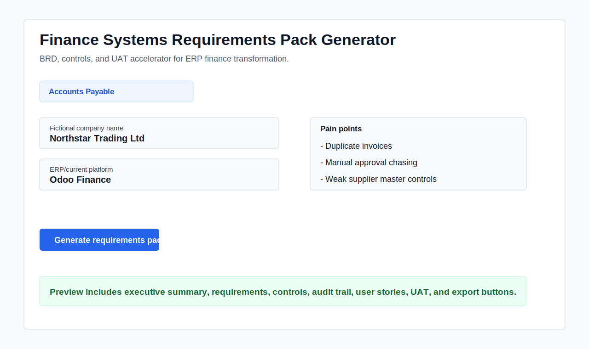
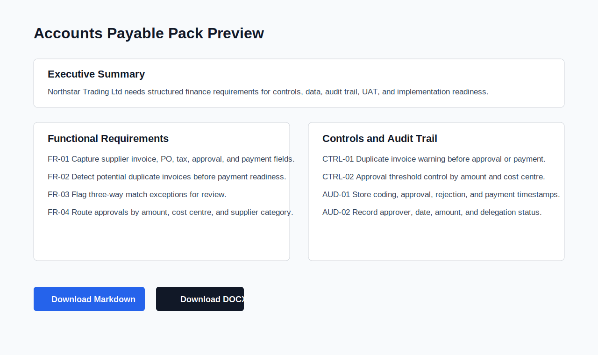

# Finance Systems Requirements Pack Generator

[](https://github.com/Chezhira/Finance-Systems-Requirements-Pack-Generator/actions/workflows/ci.yml)

Finance systems projects often fail because finance requirements are vague, controls are undocumented, data needs are unclear, and UAT expectations are not defined early enough.

This Streamlit application converts structured finance process intake into implementation-ready requirements packs for ERP and finance transformation work. It produces BRD-style scope, functional requirements, control requirements, audit trail needs, user stories, UAT test cases, acceptance criteria, and implementation risks for common finance processes.



## What It Generates

The v0.2.0 build supports eight finance processes:

- Accounts Payable: duplicate invoices, three-way match readiness, approvals, supplier master data, payment evidence, and segregation of duties.
- Bank Reconciliation: unmatched lines, ageing, owner/status tracking, suspense clearing, audit trail, and reviewer sign-off.
- VAT Reconciliation: source registers, VAT return boxes, GL VAT control accounts, reconciling differences, filing evidence, and audit trail.
- Accounts Receivable: unallocated receipts, disputed invoices, collections ageing, credit notes, write-offs, and customer master controls.
- Month-end Close: close task ownership, reconciliation evidence, journal approvals, overdue escalation, and reviewer sign-off.
- Inventory Costing: valuation differences, standard cost changes, landed cost allocation, stock adjustments, and subledger-to-GL reconciliation.
- Intercompany Settlements: recharge rules, counterparty confirmation, mismatch ageing, FX differences, settlement readiness, and elimination support.
- Payroll Controls: starter/leaver/change approvals, payroll input review, exceptions, payroll register reconciliation, and payment file approval.

Each generated pack includes:

- Executive summary
- Current-state problem statement
- Future-state process scope
- Functional and non-functional requirements
- Data requirements
- Controls and audit trail requirements
- User stories
- UAT test cases
- Acceptance criteria
- Implementation risks and dependencies



## Example Outputs

The repository includes generated sample packs:

- [Accounts Payable requirements pack](examples/generated_packs/accounts_payable_requirements_pack.md)
- [Bank Reconciliation requirements pack](examples/generated_packs/bank_reconciliation_requirements_pack.md)
- [VAT Reconciliation requirements pack](examples/generated_packs/vat_reconciliation_requirements_pack.md)
- [Accounts Receivable requirements pack](examples/generated_packs/accounts_receivable_requirements_pack.md)
- [Month-end Close requirements pack](examples/generated_packs/month_end_close_requirements_pack.md)
- [Inventory Costing requirements pack](examples/generated_packs/inventory_costing_requirements_pack.md)
- [Intercompany Settlements requirements pack](examples/generated_packs/intercompany_settlements_requirements_pack.md)
- [Payroll Controls requirements pack](examples/generated_packs/payroll_controls_requirements_pack.md)

DOCX versions are generated by the same deterministic export pipeline.

## Why This Matters For Finance Transformation

Finance systems projects rarely fail because people cannot imagine a dashboard. They fail because process ownership, source data, controls, approval evidence, audit trail, and UAT expectations were not made specific early enough. This app demonstrates finance systems analysis judgement for roles such as Business Systems Analyst, ERP Functional Consultant, Finance Systems Analyst, and Finance Transformation Analyst.

The MVP is intentionally deterministic. It does not use LLM calls, databases, authentication, or external integrations. The goal is a stable first release that proves the requirements-generation workflow before adding wider process coverage.

## Public-Safe Sample Data

The bundled examples use fictional company names and public-safe sample inputs. The repository does not contain real employer, client, supplier, bank, VAT, payroll, or operational data. Do not upload confidential business information into a public demo.

## Run Locally

```powershell
python -m venv .venv
.\.venv\Scripts\Activate.ps1
python -m pip install --upgrade pip
python -m pip install -e ".[dev]"
streamlit run app.py
```

## Generate Sample Packs

```powershell
python scripts\generate_examples.py --output-dir examples\generated_packs
```

## Test And Lint

```powershell
python -m ruff check .
python -m pytest
```

GitHub Actions runs ruff, pytest, and a sample generation smoke step on push and pull request.

## Project Structure

```text
app.py
src/finance_requirements_generator/
  questionnaire.py
  schemas.py
  template_engine.py
  exports/
  process_library/
examples/
  sample_inputs/
  generated_packs/
tests/
docs/screenshots/
```

## Roadmap

- v0.1.0: AP, bank reconciliation, VAT reconciliation, Markdown and DOCX exports, tests, CI, screenshots, and generated sample packs.
- v0.2.0: Accounts receivable, month-end close, inventory costing, intercompany settlements, payroll controls, updated sample packs, and expanded tests.
- v0.3.0: Control-risk matrix export as CSV/XLSX.
- v0.4.0: Mermaid process map generation.
- v0.5.0: Odoo module mapping and implementation checklist by process.
- Future only: AI-assisted drafting with strict schema validation, traceability, and user review.
