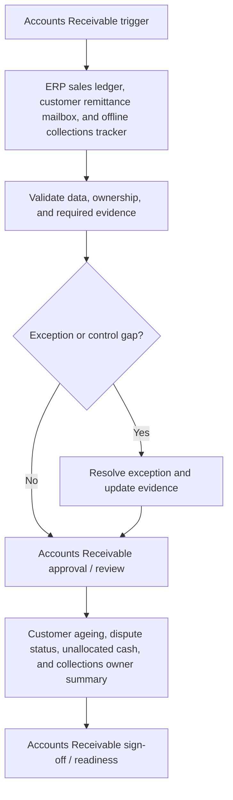

# Accounts Receivable Requirements Pack

**Prepared for:** Harbour Lane Services Ltd

**Purpose:** Translate finance process pain points into implementation-ready ERP requirements, controls, reporting needs, audit trail expectations, and UAT coverage.

## Executive Summary

Harbour Lane Services Ltd needs a structured Accounts Receivable requirements pack to reduce rework, clarify control ownership, and make NetSuite implementation decisions testable. The pack translates unallocated customer receipts, disputed invoices, and collections ageing visibility into requirements for workflow, data, controls, reporting, audit trail, and UAT. It is sized for 900 customer invoices and 700 receipts per month and frames the control design, reporting outputs, and acceptance criteria needed within a target delivery window of 9 weeks.

## Business Problem

The current Accounts Receivable process relies on ERP sales ledger, customer remittance mailbox, and offline collections tracker. That creates avoidable risk around unallocated customer receipts, disputed invoices, and collections ageing visibility and leaves finance without a consistent requirements baseline for process design, configuration, controls, reporting, and UAT. The implementation needs clearer ownership, defined data fields, control evidence, and acceptance criteria before ERP optimisation or automation can be delivered with confidence.

## Process Scope

The future-state scope covers Customer invoice generation, receipt matching, dispute tracking, collections ownership, and credit note approval; Clear customer account ageing with owner, status, and next action evidence; and Controls over customer master data, credit limits, write-offs, and cash allocation. The design will support professional services group users on NetSuite, with emphasis on credit note approval, write-off evidence, and customer master data controls.

## In Scope

- Accounts Receivable requirements for the agreed professional services group process.
- Workflow, data, controls, reporting, audit trail, and UAT requirements for NetSuite.
- Process pain points covering unallocated customer receipts, disputed invoices, and collections ageing visibility.
- Reporting requirement: Customer ageing, dispute status, unallocated cash, and collections owner summary.
- Implementation window and readiness assumptions for the 9 weeks target window.

## Out of Scope

- Live system configuration, data migration execution, and production cutover.
- Custom integration build or external workflow automation.
- Legal, tax, HR, or statutory sign-off outside the finance process owner remit.
- Direct processing of operational production data.
- Process areas outside Accounts Receivable unless approved as a separate phase.

## Stakeholders and Roles

- Finance Transformation Lead: accountable for business sign-off and prioritisation.
- Accounts Receivable process owner: validates workflow scope, controls, and exceptions.
- Finance systems analyst: translates requirements into configuration and UAT coverage.
- Preparer or operational user: confirms day-to-day inputs, handoffs, and evidence needs.
- Reviewer or controller: approves control design, reporting outputs, and acceptance criteria.

## Functional Requirements

- FR-01: Capture customer invoice number, customer account, invoice date, due date, currency, tax amount, and payment status.
- FR-02: Match customer receipts to open invoices using customer reference, amount, remittance advice, and bank receipt date.
- FR-03: Track unallocated cash with owner, ageing, reason code, and expected resolution action.
- FR-04: Record invoice disputes with dispute type, owner, status, value, and target resolution date.
- FR-05: Route credit notes and write-offs through approval thresholds before posting.
- FR-06: Maintain customer master data changes for payment terms, credit limits, billing contacts, and tax identifiers.
- FR-07: Produce collections ageing views by customer, region, owner, and risk category.
- FR-08: Link dunning activity, customer responses, and promise-to-pay dates to the customer account.

## Data Requirements

- DR-01: Customer account ID
- DR-02: Customer invoice number
- DR-03: Receipt reference
- DR-04: Remittance advice reference
- DR-05: Dispute status
- DR-06: Collections owner
- DR-07: Credit limit
- DR-08: Write-off approval reference

## Controls

- CTRL-01: Credit notes require approval based on amount, reason code, and customer risk.
- CTRL-02: Customer credit limit changes require finance owner review.
- CTRL-03: Unallocated cash over the policy threshold escalates to the collections lead.
- CTRL-04: Write-offs require supporting evidence and approval before posting.
- CTRL-05: Receipts cannot be marked resolved without allocation or approved reason code.

## Reporting Requirements

- RPT-01: Provide Customer ageing, dispute status, unallocated cash, and collections owner summary.
- RPT-02: Show owner, status, ageing, exception reason, and next action where relevant to Accounts Receivable.
- RPT-03: Support finance manager review with exportable period-end evidence.
- RPT-04: Separate open exceptions from completed, approved, or signed-off items.
- RPT-05: Make reporting outputs readable by finance users without system administrator access.

## Audit Trail Requirements

- AUD-01: Store invoice posting, receipt matching, dispute creation, credit note approval, and write-off timestamps.
- AUD-02: Record customer master data changes with old value, new value, requester, reviewer, and date.
- AUD-03: Preserve collections notes, dunning actions, and promise-to-pay updates.
- AUD-04: Track unallocated cash owner/status history.
- AUD-05: Keep approval evidence for credit notes, write-offs, and credit limit changes.

## User Stories

- As a cash allocator, I want remittance-backed receipt matching so that unallocated cash is reduced quickly.
- As a collections analyst, I want aged disputed invoices by owner so that customer follow-up is prioritised.
- As a credit controller, I want customer credit limit changes reviewed so that exposure is controlled.
- As a finance manager, I want credit note approval evidence so that revenue adjustments are defensible.
- As an auditor, I want write-off approvals and customer master changes traceable by user and date.

## UAT Test Cases

- **UAT-01:** Customer receipt arrives without a matching invoice reference. Expected result: The receipt is marked unallocated with owner, ageing, and reason fields required.
- **UAT-02:** Invoice is placed into dispute by the collections team. Expected result: Dispute type, owner, value, status, and target resolution date are stored.
- **UAT-03:** Credit note exceeds the standard threshold. Expected result: Posting is blocked until the correct approval is captured.
- **UAT-04:** Customer credit limit is increased. Expected result: Old value, new value, requester, reviewer, and approval timestamp are retained.
- **UAT-05:** A write-off is requested for an aged balance. Expected result: Supporting evidence and approval are required before write-off posting.
- **UAT-06:** Collections ageing report is exported. Expected result: Report shows customer, invoice, ageing bucket, owner, dispute status, and next action.

## Acceptance Criteria

- Unallocated receipts show owner, ageing, reason code, and expected resolution action.
- Disputed invoices are visible in AR ageing and cannot be hidden from collections reporting.
- Credit notes and write-offs require approval evidence before posting.
- Customer master changes for credit limits and payment terms are auditable.
- Collections reporting shows ageing, risk, owner, and next action without manual rework.

## Implementation Risks and Dependencies

- Customer remittance reference quality may limit automated matching rates.
- Historic unallocated cash may need cleanup before go-live.
- Credit policy thresholds must be approved by finance leadership.
- Sales and finance ownership of disputes must be agreed before workflow design.
- Customer master data may need cleansing before credit controls are reliable.

## Implementation Notes

- Confirm Accounts Receivable process owner and reviewer roles before design sign-off.
- Validate the required data fields against NetSuite configuration.
- Run UAT with approved sample scenarios before production data migration or cutover.
- Keep any future AI-assisted drafting behind structured templates and human approval.

## Visual Process Documentation

The Mermaid diagram below can be copied into Mermaid-compatible tools for rendering.

### Process Map Summary

- Trigger: Accounts Receivable trigger.
- Intake/source: ERP sales ledger, customer remittance mailbox, and offline collections tracker.
- Validation: confirm data completeness, ownership, control evidence, and exception status.
- Exception handling: route exceptions to the process owner before approval or readiness.
- Approval/review: Accounts Receivable approval / review.
- Reporting/evidence: Customer ageing, dispute status, unallocated cash, and collections owner summary.
- Sign-off/readiness: confirm Accounts Receivable evidence and acceptance criteria before build.

## Control-Risk Matrix

| Process Area | Risk Area | Risk Description | Control Objective | Control Activity | Control Type | Frequency | Owner | Evidence Required | System/Data Dependency | Related Requirement ID | Related UAT Case | Residual Risk / Implementation Note |
| --- | --- | --- | --- | --- | --- | --- | --- | --- | --- | --- | --- | --- |
| Accounts Receivable | Unallocated customer receipts | Accounts Receivable may experience unallocated customer receipts if ownership, data, controls, and evidence are not defined before build. | Reduce risk from unallocated customer receipts through clear ownership, evidence, and review criteria. | Credit notes require approval based on amount, reason code, and customer risk. | Preventive | Each transaction or batch | Accounts Receivable Process Owner | Store invoice posting, receipt matching, dispute creation, credit note approval, and write-off timestamps. | NetSuite data, required fields, owner status, and evidence references must be available for review. | FR-01 | UAT-01 | Customer remittance reference quality may limit automated matching rates. |
| Accounts Receivable | Disputed invoices | Accounts Receivable may experience disputed invoices if ownership, data, controls, and evidence are not defined before build. | Reduce risk from disputed invoices through clear ownership, evidence, and review criteria. | Customer credit limit changes require finance owner review. | Detective | Each transaction or batch | Accounts Receivable Process Owner | Record customer master data changes with old value, new value, requester, reviewer, and date. | NetSuite data, required fields, owner status, and evidence references must be available for review. | FR-02 | UAT-02 | Historic unallocated cash may need cleanup before go-live. |
| Accounts Receivable | Collections ageing visibility | Accounts Receivable may experience collections ageing visibility if ownership, data, controls, and evidence are not defined before build. | Reduce risk from collections ageing visibility through clear ownership, evidence, and review criteria. | Unallocated cash over the policy threshold escalates to the collections lead. | Corrective | Each transaction or batch | Accounts Receivable Process Owner | Preserve collections notes, dunning actions, and promise-to-pay updates. | NetSuite data, required fields, owner status, and evidence references must be available for review. | FR-03 | UAT-03 | Credit policy thresholds must be approved by finance leadership. |
| Accounts Receivable | Unallocated customer receipts | Accounts Receivable may experience unallocated customer receipts if ownership, data, controls, and evidence are not defined before build. | Reduce risk from unallocated customer receipts through clear ownership, evidence, and review criteria. | Write-offs require supporting evidence and approval before posting. | Manual | Each transaction or batch | Accounts Receivable Process Owner | Track unallocated cash owner/status history. | NetSuite data, required fields, owner status, and evidence references must be available for review. | FR-04 | UAT-04 | Sales and finance ownership of disputes must be agreed before workflow design. |
| Accounts Receivable | Disputed invoices | Accounts Receivable may experience disputed invoices if ownership, data, controls, and evidence are not defined before build. | Reduce risk from disputed invoices through clear ownership, evidence, and review criteria. | Receipts cannot be marked resolved without allocation or approved reason code. | Automated | Each transaction or batch | Accounts Receivable Process Owner | Keep approval evidence for credit notes, write-offs, and credit limit changes. | NetSuite data, required fields, owner status, and evidence references must be available for review. | FR-05 | UAT-05 | Customer master data may need cleansing before credit controls are reliable. |

## Public-Safe Sample Data Note

This pack was generated from fictional, public-safe sample inputs. It does not contain real employer, client, supplier, bank, VAT, payroll, or operational data. Do not upload confidential business information into a public demo.
