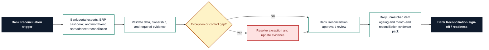

# Bank Reconciliation Requirements Pack

**Prepared for:** BlueRiver Foods Ltd

**Purpose:** Translate finance process pain points into implementation-ready ERP requirements, controls, reporting needs, audit trail expectations, and UAT coverage.

## Executive Summary

BlueRiver Foods Ltd needs a structured Bank Reconciliation requirements pack to reduce rework, clarify control ownership, and make Microsoft Dynamics 365 Business Central implementation decisions testable. The pack translates unmatched bank statement lines, suspense account ageing, and manual owner/status tracking into requirements for workflow, data, controls, reporting, audit trail, and UAT. It is sized for 8 bank accounts with roughly 4,500 statement lines per month and frames the control design, reporting outputs, and acceptance criteria needed within a target delivery window of 8 weeks.

## Business Problem

The current Bank Reconciliation process relies on Bank portal exports, ERP cashbook, and month-end spreadsheet reconciliation. That creates avoidable risk around unmatched bank statement lines, suspense account ageing, and manual owner/status tracking and leaves finance without a consistent requirements baseline for process design, configuration, controls, reporting, and UAT. The implementation needs clearer ownership, defined data fields, control evidence, and acceptance criteria before ERP optimisation or automation can be delivered with confidence.

## Process Scope

The future-state scope covers Bank statement ingestion, matching status, exception ownership, suspense clearing, and reviewer sign-off; Daily visibility of unmatched receipts, payments, fees, and transfers; and Month-end reconciliation evidence suitable for finance and audit review. The design will support multi-site food distribution business users on Microsoft Dynamics 365 Business Central, with emphasis on month-end close evidence and internal control review.

## In Scope

- Bank Reconciliation requirements for the agreed multi-site food distribution business process.
- Workflow, data, controls, reporting, audit trail, and UAT requirements for Microsoft Dynamics 365 Business Central.
- Process pain points covering unmatched bank statement lines, suspense account ageing, and manual owner/status tracking.
- Reporting requirement: Daily unmatched item ageing and month-end reconciliation evidence pack.
- Implementation window and readiness assumptions for the 8 weeks target window.

## Out of Scope

- Live system configuration, data migration execution, and production cutover.
- Custom integration build or external workflow automation.
- Legal, tax, HR, or statutory sign-off outside the finance process owner remit.
- Direct processing of operational production data.
- Process areas outside Bank Reconciliation unless approved as a separate phase.

## Stakeholders and Roles

- Finance Transformation Lead: accountable for business sign-off and prioritisation.
- Bank Reconciliation process owner: validates workflow scope, controls, and exceptions.
- Finance systems analyst: translates requirements into configuration and UAT coverage.
- Preparer or operational user: confirms day-to-day inputs, handoffs, and evidence needs.
- Reviewer or controller: approves control design, reporting outputs, and acceptance criteria.

## Functional Requirements

- FR-01: Import or capture bank statement date, value date, description, amount, currency, and bank account.
- FR-02: Match bank lines to ledger transactions using reference, amount, date tolerance, and counterparty.
- FR-03: Track unmatched lines with owner, status, reason code, ageing, and expected resolution date.
- FR-04: Separate unreconciled receipts, unreconciled payments, bank fees, transfers, and unknown items.
- FR-05: Link suspense account entries to the originating bank line and clearing journal.
- FR-06: Require reviewer sign-off once reconciliation differences are explained or cleared.
- FR-07: Produce a month-end reconciliation pack with outstanding items and movement commentary.
- FR-08: Escalate high-value or aged unmatched lines based on finance policy thresholds.

## Data Requirements

- DR-01: Bank account ID
- DR-02: Statement line ID
- DR-03: Ledger transaction ID
- DR-04: Match status
- DR-05: Exception owner
- DR-06: Ageing bucket
- DR-07: Suspense account reference
- DR-08: Reviewer sign-off timestamp

## Controls

- CTRL-01: Reviewer sign-off required before a reconciliation period is marked complete.
- CTRL-02: Aged unmatched lines escalate after the policy threshold.
- CTRL-03: Suspense clearing entries require reason codes and supporting notes.
- CTRL-04: Manual match overrides require reviewer approval.
- CTRL-05: Reconciliation status is locked after period close except through controlled reopen.

## Reporting Requirements

- RPT-01: Provide Daily unmatched item ageing and month-end reconciliation evidence pack.
- RPT-02: Show owner, status, ageing, exception reason, and next action where relevant to Bank Reconciliation.
- RPT-03: Support finance manager review with exportable period-end evidence.
- RPT-04: Separate open exceptions from completed, approved, or signed-off items.
- RPT-05: Make reporting outputs readable by finance users without system administrator access.

## Audit Trail Requirements

- AUD-01: Store all matching, unmatching, manual override, and suspense clearing actions.
- AUD-02: Record preparer completion and reviewer sign-off timestamps.
- AUD-03: Keep owner/status history for aged unmatched lines.
- AUD-04: Preserve supporting notes and evidence links for unresolved differences.
- AUD-05: Record period reopen requests with reason, requester, approver, and date.

## User Stories

- As a reconciliation preparer, I want unmatched lines grouped by ageing so that old differences are prioritised.
- As a finance manager, I want suspense clearing status so that unresolved items do not hide at month end.
- As a reviewer, I want clear sign-off evidence so that reconciliation completion is defensible.
- As an auditor, I want manual match override history so that judgemental matches can be reviewed.
- As a treasury analyst, I want bank fees and transfers separated so that routine items are cleared quickly.

## UAT Test Cases

- **UAT-01:** A bank statement line has no ledger match after import. Expected result: The line is marked unmatched with owner, ageing, and reason fields required.
- **UAT-02:** A suspense item remains open past the policy threshold. Expected result: The item is escalated and appears in the aged suspense view.
- **UAT-03:** A preparer manually matches two transactions. Expected result: The manual override is logged and requires reviewer approval.
- **UAT-04:** Reviewer signs off a completed reconciliation. Expected result: Reviewer name, timestamp, and outstanding item summary are saved.
- **UAT-05:** A closed reconciliation period is reopened. Expected result: Reopen reason and approver are recorded before edits are allowed.
- **UAT-06:** Month-end pack is exported. Expected result: The pack includes unmatched lines, ageing, suspense movements, and reviewer sign-off.

## Acceptance Criteria

- Unmatched lines show owner, status, ageing, reason, and expected resolution date.
- Suspense account items can be traced from bank line to clearing journal.
- Reviewer sign-off is mandatory before period completion.
- Manual overrides are visible in the audit trail.
- Month-end reconciliation pack exports without manual formatting.

## Implementation Risks and Dependencies

- Bank statement formats must be standardised across accounts.
- Ledger reference quality may limit automated matching rates.
- Finance policy thresholds for ageing and escalation must be approved.
- Reviewer roles must be configured before go-live.
- Historic suspense items may need cleanup before migration.

## Implementation Notes

- Confirm Bank Reconciliation process owner and reviewer roles before design sign-off.
- Validate the required data fields against Microsoft Dynamics 365 Business Central configuration.
- Run UAT with approved sample scenarios before production data migration or cutover.
- Keep any future AI-assisted drafting behind structured templates and human approval.

## Visual Process Documentation

The Mermaid diagram below can be copied into Mermaid-compatible tools for rendering.

### Process Map Summary

- Trigger: Bank Reconciliation trigger.
- Intake/source: Bank portal exports, ERP cashbook, and month-end spreadsheet reconciliation.
- Validation: confirm data completeness, ownership, control evidence, and exception status.
- Exception handling: route exceptions to the process owner before approval or readiness.
- Approval/review: Bank Reconciliation approval / review.
- Reporting/evidence: Daily unmatched item ageing and month-end reconciliation evidence pack.
- Sign-off/readiness: confirm Bank Reconciliation evidence and acceptance criteria before build.

## Control-Risk Matrix

| Process Area | Risk Area | Risk Description | Control Objective | Control Activity | Control Type | Frequency | Owner | Evidence Required | System/Data Dependency | Related Requirement ID | Related UAT Case | Residual Risk / Implementation Note |
| --- | --- | --- | --- | --- | --- | --- | --- | --- | --- | --- | --- | --- |
| Bank Reconciliation | Unmatched bank statement lines | Bank Reconciliation may experience unmatched bank statement lines if ownership, data, controls, and evidence are not defined before build. | Reduce risk from unmatched bank statement lines through clear ownership, evidence, and review criteria. | Reviewer sign-off required before a reconciliation period is marked complete. | Preventive | Each period close | Bank Reconciliation Process Owner | Store all matching, unmatching, manual override, and suspense clearing actions. | Microsoft Dynamics 365 Business Central data, required fields, owner status, and evidence references must be available for review. | FR-01 | UAT-01 | Bank statement formats must be standardised across accounts. |
| Bank Reconciliation | Suspense account ageing | Bank Reconciliation may experience suspense account ageing if ownership, data, controls, and evidence are not defined before build. | Reduce risk from suspense account ageing through clear ownership, evidence, and review criteria. | Aged unmatched lines escalate after the policy threshold. | Detective | Each period close | Bank Reconciliation Process Owner | Record preparer completion and reviewer sign-off timestamps. | Microsoft Dynamics 365 Business Central data, required fields, owner status, and evidence references must be available for review. | FR-02 | UAT-02 | Ledger reference quality may limit automated matching rates. |
| Bank Reconciliation | Manual owner/status tracking | Bank Reconciliation may experience manual owner/status tracking if ownership, data, controls, and evidence are not defined before build. | Reduce risk from manual owner/status tracking through clear ownership, evidence, and review criteria. | Suspense clearing entries require reason codes and supporting notes. | Corrective | Each period close | Bank Reconciliation Process Owner | Keep owner/status history for aged unmatched lines. | Microsoft Dynamics 365 Business Central data, required fields, owner status, and evidence references must be available for review. | FR-03 | UAT-03 | Finance policy thresholds for ageing and escalation must be approved. |
| Bank Reconciliation | Unmatched bank statement lines | Bank Reconciliation may experience unmatched bank statement lines if ownership, data, controls, and evidence are not defined before build. | Reduce risk from unmatched bank statement lines through clear ownership, evidence, and review criteria. | Manual match overrides require reviewer approval. | Manual | Each period close | Bank Reconciliation Process Owner | Preserve supporting notes and evidence links for unresolved differences. | Microsoft Dynamics 365 Business Central data, required fields, owner status, and evidence references must be available for review. | FR-04 | UAT-04 | Reviewer roles must be configured before go-live. |
| Bank Reconciliation | Suspense account ageing | Bank Reconciliation may experience suspense account ageing if ownership, data, controls, and evidence are not defined before build. | Reduce risk from suspense account ageing through clear ownership, evidence, and review criteria. | Reconciliation status is locked after period close except through controlled reopen. | Automated | Each period close | Bank Reconciliation Process Owner | Record period reopen requests with reason, requester, approver, and date. | Microsoft Dynamics 365 Business Central data, required fields, owner status, and evidence references must be available for review. | FR-05 | UAT-05 | Historic suspense items may need cleanup before migration. |

## Public-Safe Sample Data Note

This pack was generated from fictional, public-safe sample inputs. It does not contain real employer, client, supplier, bank, VAT, payroll, or operational data. Do not upload confidential business information into a public demo.
