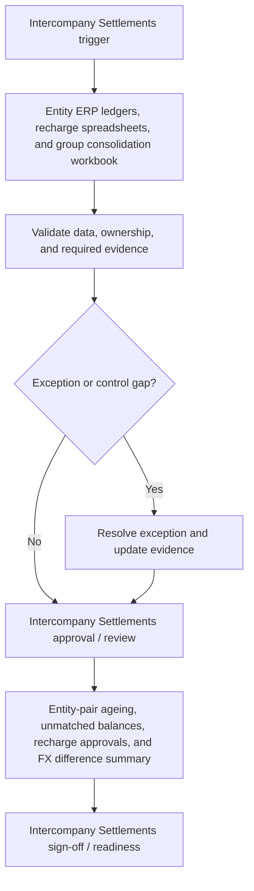

# Intercompany Settlements Requirements Pack

**Prepared for:** Summit Group Holdings Ltd

**Purpose:** Translate finance process pain points into implementation-ready ERP requirements, controls, reporting needs, audit trail expectations, and UAT coverage.

## Executive Summary

Summit Group Holdings Ltd needs a structured Intercompany Settlements requirements pack to reduce rework, clarify control ownership, and make Oracle NetSuite OneWorld implementation decisions testable. The pack translates intercompany mismatch ageing, recharge rule ambiguity, and fX difference review gaps into requirements for workflow, data, controls, reporting, audit trail, and UAT. It is sized for 14 entities, 320 intercompany lines, and 5 settlement currencies per month and frames the control design, reporting outputs, and acceptance criteria needed within a target delivery window of 10 weeks.

## Business Problem

The current Intercompany Settlements process relies on Entity ERP ledgers, recharge spreadsheets, and group consolidation workbook. That creates avoidable risk around intercompany mismatch ageing, recharge rule ambiguity, and fX difference review gaps and leaves finance without a consistent requirements baseline for process design, configuration, controls, reporting, and UAT. The implementation needs clearer ownership, defined data fields, control evidence, and acceptance criteria before ERP optimisation or automation can be delivered with confidence.

## Process Scope

The future-state scope covers Intercompany recharge creation, counterparty confirmation, matching, settlement tracking, FX difference review, and elimination support; Visibility of balances by entity, counterparty, transaction type, currency, owner, and ageing; and Controls over recharge approval, settlement readiness, and period-end elimination evidence. The design will support multi-entity group with shared service recharges users on Oracle NetSuite OneWorld, with emphasis on counterparty confirmation, recharge approval, settlement evidence, and elimination support.

## In Scope

- Intercompany Settlements requirements for the agreed multi-entity group with shared service recharges process.
- Workflow, data, controls, reporting, audit trail, and UAT requirements for Oracle NetSuite OneWorld.
- Process pain points covering intercompany mismatch ageing, recharge rule ambiguity, and fX difference review gaps.
- Reporting requirement: Entity-pair ageing, unmatched balances, recharge approvals, and FX difference summary.
- Implementation window and readiness assumptions for the 10 weeks target window.

## Out of Scope

- Live system configuration, data migration execution, and production cutover.
- Custom integration build or external workflow automation.
- Legal, tax, HR, or statutory sign-off outside the finance process owner remit.
- Direct processing of operational production data.
- Process areas outside Intercompany Settlements unless approved as a separate phase.

## Stakeholders and Roles

- Finance Transformation Lead: accountable for business sign-off and prioritisation.
- Intercompany Settlements process owner: validates workflow scope, controls, and exceptions.
- Finance systems analyst: translates requirements into configuration and UAT coverage.
- Preparer or operational user: confirms day-to-day inputs, handoffs, and evidence needs.
- Reviewer or controller: approves control design, reporting outputs, and acceptance criteria.

## Functional Requirements

- FR-01: Capture originating entity, counterparty entity, recharge type, currency, amount, tax treatment, and settlement status.
- FR-02: Match intercompany AR/AP balances by counterparty, invoice reference, amount, currency, and period.
- FR-03: Track unmatched intercompany balances with owner, ageing, reason code, and expected settlement date.
- FR-04: Store recharge rules, allocation basis, supporting calculation, requester, reviewer, and approval status.
- FR-05: Identify FX differences by entity pair, currency, transaction reference, and materiality threshold.
- FR-06: Require counterparty confirmation before settlement readiness or elimination support sign-off.
- FR-07: Produce intercompany ageing and mismatch reports by entity pair and transaction type.
- FR-08: Export elimination support evidence for group reporting review.

## Data Requirements

- DR-01: Originating entity
- DR-02: Counterparty entity
- DR-03: Recharge reference
- DR-04: Counterparty invoice reference
- DR-05: Transaction currency
- DR-06: Settlement status
- DR-07: FX difference
- DR-08: Elimination support reference

## Controls

- CTRL-01: Recharge rules and allocation basis require finance owner approval.
- CTRL-02: Counterparty confirmation is required before settlement readiness.
- CTRL-03: Aged unmatched intercompany balances escalate to group finance.
- CTRL-04: FX differences over materiality threshold require review and explanation.
- CTRL-05: Elimination support cannot be marked complete until mismatches are resolved or approved.

## Reporting Requirements

- RPT-01: Provide Entity-pair ageing, unmatched balances, recharge approvals, and FX difference summary.
- RPT-02: Show owner, status, ageing, exception reason, and next action where relevant to Intercompany Settlements.
- RPT-03: Support finance manager review with exportable period-end evidence.
- RPT-04: Separate open exceptions from completed, approved, or signed-off items.
- RPT-05: Make reporting outputs readable by finance users without system administrator access.

## Audit Trail Requirements

- AUD-01: Store recharge creation, approval, counterparty confirmation, settlement, and elimination sign-off timestamps.
- AUD-02: Record allocation basis changes with requester, reviewer, reason, and effective period.
- AUD-03: Track unmatched balance owner/status history by entity pair.
- AUD-04: Preserve FX difference explanations and reviewer decisions.
- AUD-05: Keep counterparty confirmation evidence and settlement approval references.

## User Stories

- As an entity accountant, I want counterparty confirmation so that intercompany mismatches are resolved before close.
- As group finance, I want ageing by entity pair so that old balances are escalated quickly.
- As a recharge preparer, I want approved allocation rules so that recharge calculations are consistent.
- As a reviewer, I want FX differences explained so that group reporting variances are defensible.
- As an auditor, I want elimination support evidence so that consolidation adjustments are traceable.

## UAT Test Cases

- **UAT-01:** Intercompany AR balance does not match the counterparty AP balance. Expected result: A mismatch is created with entity pair, owner, ageing, and reason fields.
- **UAT-02:** Recharge allocation basis is changed. Expected result: The change requires approval and stores reason, requester, reviewer, and effective period.
- **UAT-03:** Counterparty confirmation is missing. Expected result: Settlement readiness and elimination sign-off are blocked.
- **UAT-04:** FX difference exceeds materiality threshold. Expected result: Review explanation and approval are required before completion.
- **UAT-05:** Aged unmatched balance passes escalation threshold. Expected result: Group finance receives escalation and the item appears in the aged mismatch report.
- **UAT-06:** Intercompany settlement pack is exported. Expected result: The pack includes balances, mismatches, confirmations, FX differences, settlement status, and elimination evidence.

## Acceptance Criteria

- Intercompany balances show entity pair, currency, reference, owner, status, and ageing.
- Recharge allocation rules are approved and versioned.
- Counterparty confirmation is required before settlement readiness.
- FX differences above threshold are explained and approved.
- Elimination support exports with mismatch and sign-off evidence.

## Implementation Risks and Dependencies

- Entity chart-of-account mapping must be aligned for counterparty matching.
- Recharge policies and allocation methods require group finance approval.
- Multi-currency treatment must align with accounting policy.
- Historic unmatched balances may need remediation before rollout.
- Entity teams must agree ownership of mismatch resolution.

## Implementation Notes

- Confirm Intercompany Settlements process owner and reviewer roles before design sign-off.
- Validate the required data fields against Oracle NetSuite OneWorld configuration.
- Run UAT with approved sample scenarios before production data migration or cutover.
- Keep any future AI-assisted drafting behind structured templates and human approval.

## Visual Process Documentation

The Mermaid diagram below can be copied into Mermaid-compatible tools for rendering.

### Process Map Summary

- Trigger: Intercompany Settlements trigger.
- Intake/source: Entity ERP ledgers, recharge spreadsheets, and group consolidation workbook.
- Validation: confirm data completeness, ownership, control evidence, and exception status.
- Exception handling: route exceptions to the process owner before approval or readiness.
- Approval/review: Intercompany Settlements approval / review.
- Reporting/evidence: Entity-pair ageing, unmatched balances, recharge approvals, and FX difference summary.
- Sign-off/readiness: confirm Intercompany Settlements evidence and acceptance criteria before build.

## Control-Risk Matrix

| Process Area | Risk Area | Risk Description | Control Objective | Control Activity | Control Type | Frequency | Owner | Evidence Required | System/Data Dependency | Related Requirement ID | Related UAT Case | Residual Risk / Implementation Note |
| --- | --- | --- | --- | --- | --- | --- | --- | --- | --- | --- | --- | --- |
| Intercompany Settlements | Intercompany mismatch ageing | Intercompany Settlements may experience intercompany mismatch ageing if ownership, data, controls, and evidence are not defined before build. | Reduce risk from intercompany mismatch ageing through clear ownership, evidence, and review criteria. | Recharge rules and allocation basis require finance owner approval. | Preventive | Each transaction or batch | Intercompany Settlements Process Owner | Store recharge creation, approval, counterparty confirmation, settlement, and elimination sign-off timestamps. | Oracle NetSuite OneWorld data, required fields, owner status, and evidence references must be available for review. | FR-01 | UAT-01 | Entity chart-of-account mapping must be aligned for counterparty matching. |
| Intercompany Settlements | Recharge rule ambiguity | Intercompany Settlements may experience recharge rule ambiguity if ownership, data, controls, and evidence are not defined before build. | Reduce risk from recharge rule ambiguity through clear ownership, evidence, and review criteria. | Counterparty confirmation is required before settlement readiness. | Detective | Each transaction or batch | Intercompany Settlements Process Owner | Record allocation basis changes with requester, reviewer, reason, and effective period. | Oracle NetSuite OneWorld data, required fields, owner status, and evidence references must be available for review. | FR-02 | UAT-02 | Recharge policies and allocation methods require group finance approval. |
| Intercompany Settlements | FX difference review gaps | Intercompany Settlements may experience fx difference review gaps if ownership, data, controls, and evidence are not defined before build. | Reduce risk from fx difference review gaps through clear ownership, evidence, and review criteria. | Aged unmatched intercompany balances escalate to group finance. | Corrective | Each transaction or batch | Intercompany Settlements Process Owner | Track unmatched balance owner/status history by entity pair. | Oracle NetSuite OneWorld data, required fields, owner status, and evidence references must be available for review. | FR-03 | UAT-03 | Multi-currency treatment must align with accounting policy. |
| Intercompany Settlements | Intercompany mismatch ageing | Intercompany Settlements may experience intercompany mismatch ageing if ownership, data, controls, and evidence are not defined before build. | Reduce risk from intercompany mismatch ageing through clear ownership, evidence, and review criteria. | FX differences over materiality threshold require review and explanation. | Manual | Each transaction or batch | Intercompany Settlements Process Owner | Preserve FX difference explanations and reviewer decisions. | Oracle NetSuite OneWorld data, required fields, owner status, and evidence references must be available for review. | FR-04 | UAT-04 | Historic unmatched balances may need remediation before rollout. |
| Intercompany Settlements | Recharge rule ambiguity | Intercompany Settlements may experience recharge rule ambiguity if ownership, data, controls, and evidence are not defined before build. | Reduce risk from recharge rule ambiguity through clear ownership, evidence, and review criteria. | Elimination support cannot be marked complete until mismatches are resolved or approved. | Automated | Each transaction or batch | Intercompany Settlements Process Owner | Keep counterparty confirmation evidence and settlement approval references. | Oracle NetSuite OneWorld data, required fields, owner status, and evidence references must be available for review. | FR-05 | UAT-05 | Entity teams must agree ownership of mismatch resolution. |

## Public-Safe Sample Data Note

This pack was generated from fictional, public-safe sample inputs. It does not contain real employer, client, supplier, bank, VAT, payroll, or operational data. Do not upload confidential business information into a public demo.
