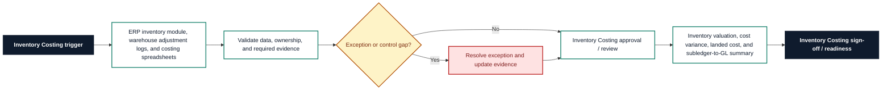

# Inventory Costing Requirements Pack

**Prepared for:** MapleWorks Components Ltd

**Purpose:** Translate finance process pain points into implementation-ready ERP requirements, controls, reporting needs, audit trail expectations, and UAT coverage.

## Executive Summary

MapleWorks Components Ltd needs a structured Inventory Costing requirements pack to reduce rework, clarify control ownership, and make SAP Business One implementation decisions testable. The pack translates inventory valuation differences, cost variance review gaps, and manual landed cost allocation into requirements for workflow, data, controls, reporting, audit trail, and UAT. It is sized for 4 warehouses, 2,800 SKUs, and monthly standard cost review and frames the control design, reporting outputs, and acceptance criteria needed within a target delivery window of 11 weeks.

## Business Problem

The current Inventory Costing process relies on ERP inventory module, warehouse adjustment logs, and costing spreadsheets. That creates avoidable risk around inventory valuation differences, cost variance review gaps, and manual landed cost allocation and leaves finance without a consistent requirements baseline for process design, configuration, controls, reporting, and UAT. The implementation needs clearer ownership, defined data fields, control evidence, and acceptance criteria before ERP optimisation or automation can be delivered with confidence.

## Process Scope

The future-state scope covers Inventory valuation, cost updates, landed cost allocation, variance review, stock adjustments, and GL reconciliation; Visibility of standard cost, actual cost, purchase price variance, production variance, and inventory ageing; and Controls over costing method changes, manual adjustments, and reconciliation sign-off. The design will support light manufacturing business users on SAP Business One, with emphasis on cost change approvals, stock adjustment controls, and valuation audit evidence.

## In Scope

- Inventory Costing requirements for the agreed light manufacturing business process.
- Workflow, data, controls, reporting, audit trail, and UAT requirements for SAP Business One.
- Process pain points covering inventory valuation differences, cost variance review gaps, and manual landed cost allocation.
- Reporting requirement: Inventory valuation, cost variance, landed cost, and subledger-to-GL summary.
- Implementation window and readiness assumptions for the 11 weeks target window.

## Out of Scope

- Live system configuration, data migration execution, and production cutover.
- Custom integration build or external workflow automation.
- Legal, tax, HR, or statutory sign-off outside the finance process owner remit.
- Direct processing of operational production data.
- Process areas outside Inventory Costing unless approved as a separate phase.

## Stakeholders and Roles

- Finance Transformation Lead: accountable for business sign-off and prioritisation.
- Inventory Costing process owner: validates workflow scope, controls, and exceptions.
- Finance systems analyst: translates requirements into configuration and UAT coverage.
- Preparer or operational user: confirms day-to-day inputs, handoffs, and evidence needs.
- Reviewer or controller: approves control design, reporting outputs, and acceptance criteria.

## Functional Requirements

- FR-01: Capture SKU, warehouse, quantity, unit cost, valuation method, cost version, and inventory value.
- FR-02: Reconcile inventory subledger balances to GL inventory control accounts by period and location.
- FR-03: Track standard cost updates with effective date, reason, requester, reviewer, and approval status.
- FR-04: Allocate landed costs using approved allocation basis and link charges to receipt or shipment references.
- FR-05: Identify purchase price variance, production variance, and manual cost adjustments by materiality threshold.
- FR-06: Route stock adjustments and write-downs for approval before posting.
- FR-07: Produce inventory valuation reports by SKU, warehouse, ageing bucket, cost method, and variance category.
- FR-08: Preserve costing assumptions and supporting evidence for finance review.

## Data Requirements

- DR-01: SKU/item ID
- DR-02: Warehouse/location
- DR-03: Quantity on hand
- DR-04: Unit cost
- DR-05: Valuation method
- DR-06: Landed cost reference
- DR-07: Inventory control account
- DR-08: Cost variance reason code

## Controls

- CTRL-01: Standard cost changes require approval before effective date.
- CTRL-02: Stock adjustments and write-downs require reason codes and reviewer sign-off.
- CTRL-03: Inventory subledger-to-GL differences over threshold require owner assignment.
- CTRL-04: Landed cost allocation basis must be approved and retained.
- CTRL-05: Costing method changes require finance controller approval.

## Reporting Requirements

- RPT-01: Provide Inventory valuation, cost variance, landed cost, and subledger-to-GL summary.
- RPT-02: Show owner, status, ageing, exception reason, and next action where relevant to Inventory Costing.
- RPT-03: Support finance manager review with exportable period-end evidence.
- RPT-04: Separate open exceptions from completed, approved, or signed-off items.
- RPT-05: Make reporting outputs readable by finance users without system administrator access.

## Audit Trail Requirements

- AUD-01: Store cost version changes with old value, new value, requester, approver, and effective date.
- AUD-02: Record stock adjustment creation, approval, posting, and reversal history.
- AUD-03: Preserve landed cost allocation inputs, basis, reviewer, and timestamp.
- AUD-04: Track subledger-to-GL reconciliation owner/status history.
- AUD-05: Keep valuation report export and sign-off evidence by period.

## User Stories

- As a cost accountant, I want cost variance exceptions by SKU so that material valuation issues are reviewed.
- As a finance manager, I want inventory subledger-to-GL reconciliation so that balance sheet inventory is supported.
- As an operations manager, I want stock adjustments routed for approval so that shrinkage and corrections are controlled.
- As a controller, I want standard cost change history so that margin movements can be explained.
- As an auditor, I want landed cost allocation evidence so that inventory valuation assumptions are traceable.

## UAT Test Cases

- **UAT-01:** Standard cost is changed for a material SKU. Expected result: Old value, new value, reason, requester, approver, and effective date are recorded.
- **UAT-02:** Inventory subledger does not match the GL control account. Expected result: A reconciliation difference is created with owner, amount, and reason fields.
- **UAT-03:** Landed cost allocation is posted. Expected result: Allocation basis, source charge, receipt reference, and reviewer evidence are stored.
- **UAT-04:** Stock adjustment exceeds approval threshold. Expected result: Posting is blocked until reviewer sign-off is captured.
- **UAT-05:** Cost variance exceeds materiality threshold. Expected result: The variance appears in the costing exception report with owner and category.
- **UAT-06:** Inventory valuation pack is exported. Expected result: The pack includes valuation, variances, adjustments, landed costs, and GL reconciliation status.

## Acceptance Criteria

- Inventory valuation reports show SKU, location, quantity, unit cost, value, and cost method.
- Standard cost changes and costing method changes are approved and auditable.
- Stock adjustments cannot post without reason code and approval where required.
- Subledger-to-GL differences are owner-assigned and visible by period.
- Landed cost allocation evidence is retained with basis and reviewer sign-off.

## Implementation Risks and Dependencies

- Item master data and warehouse locations may need cleanup before reliable valuation reporting.
- Approved costing method and standard cost policy must be confirmed.
- Landed cost source data may depend on procurement and logistics integration.
- Historic stock adjustments may require review before migration.
- Operations and finance ownership of variance resolution must be agreed.

## Implementation Notes

- Confirm Inventory Costing process owner and reviewer roles before design sign-off.
- Validate the required data fields against SAP Business One configuration.
- Run UAT with approved sample scenarios before production data migration or cutover.
- Keep any future AI-assisted drafting behind structured templates and human approval.

## Visual Process Documentation

The Mermaid diagram below can be copied into Mermaid-compatible tools for rendering.

### Process Map Summary

- Trigger: Inventory Costing trigger.
- Intake/source: ERP inventory module, warehouse adjustment logs, and costing spreadsheets.
- Validation: confirm data completeness, ownership, control evidence, and exception status.
- Exception handling: route exceptions to the process owner before approval or readiness.
- Approval/review: Inventory Costing approval / review.
- Reporting/evidence: Inventory valuation, cost variance, landed cost, and subledger-to-GL summary.
- Sign-off/readiness: confirm Inventory Costing evidence and acceptance criteria before build.

## Control-Risk Matrix

| Process Area | Risk Area | Risk Description | Control Objective | Control Activity | Control Type | Frequency | Owner | Evidence Required | System/Data Dependency | Related Requirement ID | Related UAT Case | Residual Risk / Implementation Note |
| --- | --- | --- | --- | --- | --- | --- | --- | --- | --- | --- | --- | --- |
| Inventory Costing | Inventory valuation differences | Inventory Costing may experience inventory valuation differences if ownership, data, controls, and evidence are not defined before build. | Reduce risk from inventory valuation differences through clear ownership, evidence, and review criteria. | Standard cost changes require approval before effective date. | Preventive | Each transaction or batch | Inventory Costing Process Owner | Store cost version changes with old value, new value, requester, approver, and effective date. | SAP Business One data, required fields, owner status, and evidence references must be available for review. | FR-01 | UAT-01 | Item master data and warehouse locations may need cleanup before reliable valuation reporting. |
| Inventory Costing | Cost variance review gaps | Inventory Costing may experience cost variance review gaps if ownership, data, controls, and evidence are not defined before build. | Reduce risk from cost variance review gaps through clear ownership, evidence, and review criteria. | Stock adjustments and write-downs require reason codes and reviewer sign-off. | Detective | Each transaction or batch | Inventory Costing Process Owner | Record stock adjustment creation, approval, posting, and reversal history. | SAP Business One data, required fields, owner status, and evidence references must be available for review. | FR-02 | UAT-02 | Approved costing method and standard cost policy must be confirmed. |
| Inventory Costing | Manual landed cost allocation | Inventory Costing may experience manual landed cost allocation if ownership, data, controls, and evidence are not defined before build. | Reduce risk from manual landed cost allocation through clear ownership, evidence, and review criteria. | Inventory subledger-to-GL differences over threshold require owner assignment. | Corrective | Each transaction or batch | Inventory Costing Process Owner | Preserve landed cost allocation inputs, basis, reviewer, and timestamp. | SAP Business One data, required fields, owner status, and evidence references must be available for review. | FR-03 | UAT-03 | Landed cost source data may depend on procurement and logistics integration. |
| Inventory Costing | Inventory valuation differences | Inventory Costing may experience inventory valuation differences if ownership, data, controls, and evidence are not defined before build. | Reduce risk from inventory valuation differences through clear ownership, evidence, and review criteria. | Landed cost allocation basis must be approved and retained. | Manual | Each transaction or batch | Inventory Costing Process Owner | Track subledger-to-GL reconciliation owner/status history. | SAP Business One data, required fields, owner status, and evidence references must be available for review. | FR-04 | UAT-04 | Historic stock adjustments may require review before migration. |
| Inventory Costing | Cost variance review gaps | Inventory Costing may experience cost variance review gaps if ownership, data, controls, and evidence are not defined before build. | Reduce risk from cost variance review gaps through clear ownership, evidence, and review criteria. | Costing method changes require finance controller approval. | Automated | Each transaction or batch | Inventory Costing Process Owner | Keep valuation report export and sign-off evidence by period. | SAP Business One data, required fields, owner status, and evidence references must be available for review. | FR-05 | UAT-05 | Operations and finance ownership of variance resolution must be agreed. |

## Public-Safe Sample Data Note

This pack was generated from fictional, public-safe sample inputs. It does not contain real employer, client, supplier, bank, VAT, payroll, or operational data. Do not upload confidential business information into a public demo.
