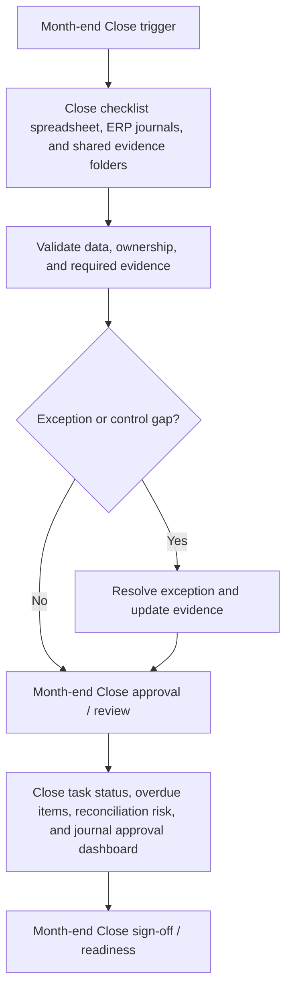

# Month-end Close Requirements Pack

**Prepared for:** Cedar Grove Retail Ltd

**Purpose:** Translate finance process pain points into implementation-ready ERP requirements, controls, reporting needs, audit trail expectations, and UAT coverage.

## Executive Summary

Cedar Grove Retail Ltd needs a structured Month-end Close requirements pack to reduce rework, clarify control ownership, and make Microsoft Dynamics 365 Finance implementation decisions testable. The pack translates late close tasks, manual close status tracking, and missing reconciliation evidence into requirements for workflow, data, controls, reporting, audit trail, and UAT. It is sized for 125 close tasks, 70 reconciliations, and 220 journals per period and frames the control design, reporting outputs, and acceptance criteria needed within a target delivery window of 12 weeks.

## Business Problem

The current Month-end Close process relies on Close checklist spreadsheet, ERP journals, and shared evidence folders. That creates avoidable risk around late close tasks, manual close status tracking, and missing reconciliation evidence and leaves finance without a consistent requirements baseline for process design, configuration, controls, reporting, and UAT. The implementation needs clearer ownership, defined data fields, control evidence, and acceptance criteria before ERP optimisation or automation can be delivered with confidence.

## Process Scope

The future-state scope covers Close task calendar, preparer/reviewer ownership, journal approval, reconciliation completion, and close reporting; Daily close status visibility with overdue task escalation and dependency tracking; and Evidence pack for finance leadership, internal controls, and audit review. The design will support multi-entity retail group users on Microsoft Dynamics 365 Finance, with emphasis on close evidence, journal approvals, reviewer sign-off, and period completion controls.

## In Scope

- Month-end Close requirements for the agreed multi-entity retail group process.
- Workflow, data, controls, reporting, audit trail, and UAT requirements for Microsoft Dynamics 365 Finance.
- Process pain points covering late close tasks, manual close status tracking, and missing reconciliation evidence.
- Reporting requirement: Close task status, overdue items, reconciliation risk, and journal approval dashboard.
- Implementation window and readiness assumptions for the 12 weeks target window.

## Out of Scope

- Live system configuration, data migration execution, and production cutover.
- Custom integration build or external workflow automation.
- Legal, tax, HR, or statutory sign-off outside the finance process owner remit.
- Direct processing of operational production data.
- Process areas outside Month-end Close unless approved as a separate phase.

## Stakeholders and Roles

- Finance Transformation Lead: accountable for business sign-off and prioritisation.
- Month-end Close process owner: validates workflow scope, controls, and exceptions.
- Finance systems analyst: translates requirements into configuration and UAT coverage.
- Preparer or operational user: confirms day-to-day inputs, handoffs, and evidence needs.
- Reviewer or controller: approves control design, reporting outputs, and acceptance criteria.

## Functional Requirements

- FR-01: Maintain a close calendar with task owner, reviewer, due date, dependency, status, and completion evidence.
- FR-02: Track balance sheet reconciliations by account, preparer, reviewer, risk rating, and sign-off status.
- FR-03: Route manual journals for approval based on journal type, value, and account risk.
- FR-04: Escalate overdue tasks to close lead and finance controller based on policy thresholds.
- FR-05: Capture close commentary for material movements, open items, and unresolved exceptions.
- FR-06: Lock completed tasks after reviewer sign-off unless reopened through controlled approval.
- FR-07: Produce a close dashboard showing task completion, late items, high-risk reconciliations, and journal status.
- FR-08: Export a month-end close evidence pack with task, reconciliation, journal, and sign-off details.

## Data Requirements

- DR-01: Close period
- DR-02: Close task ID
- DR-03: Task owner
- DR-04: Reviewer
- DR-05: Balance sheet account
- DR-06: Journal batch reference
- DR-07: Completion evidence link
- DR-08: Sign-off timestamp

## Controls

- CTRL-01: Reviewer sign-off required before high-risk reconciliations are marked complete.
- CTRL-02: Manual journals require approval before posting to closed periods.
- CTRL-03: Overdue close tasks escalate based on close calendar thresholds.
- CTRL-04: Reopened tasks require reason, requester, approver, and timestamp.
- CTRL-05: Period close completion requires all mandatory tasks and reconciliations to be signed off.

## Reporting Requirements

- RPT-01: Provide Close task status, overdue items, reconciliation risk, and journal approval dashboard.
- RPT-02: Show owner, status, ageing, exception reason, and next action where relevant to Month-end Close.
- RPT-03: Support finance manager review with exportable period-end evidence.
- RPT-04: Separate open exceptions from completed, approved, or signed-off items.
- RPT-05: Make reporting outputs readable by finance users without system administrator access.

## Audit Trail Requirements

- AUD-01: Store task status changes, evidence uploads, preparer completion, and reviewer sign-off timestamps.
- AUD-02: Record journal submission, approval, rejection, posting, and reversal history.
- AUD-03: Preserve reopen reasons and approval decisions for closed tasks.
- AUD-04: Track reconciliation owner/status history for each close period.
- AUD-05: Keep close pack export timestamp, preparer, reviewer, and final approver evidence.

## User Stories

- As a close lead, I want overdue tasks escalated so that blockers are visible before reporting deadlines.
- As a preparer, I want one place to attach reconciliation evidence so that reviewer sign-off is faster.
- As a reviewer, I want high-risk accounts highlighted so that review effort follows materiality.
- As a finance controller, I want journal approval status so that unposted adjustments do not surprise the close.
- As an auditor, I want close task and journal approval history by period so that evidence is traceable.

## UAT Test Cases

- **UAT-01:** A mandatory close task passes its due date without completion. Expected result: The task is escalated and appears in the overdue close view.
- **UAT-02:** A high-risk reconciliation is submitted without evidence. Expected result: Reviewer sign-off is blocked until evidence is attached.
- **UAT-03:** Manual journal exceeds the approval threshold. Expected result: Posting is blocked until the correct approver signs off.
- **UAT-04:** A completed close task is reopened. Expected result: Reopen reason, requester, approver, and timestamp are recorded.
- **UAT-05:** Period completion is attempted with open mandatory tasks. Expected result: Completion is blocked and open tasks are listed.
- **UAT-06:** Month-end close pack is exported. Expected result: The pack includes task completion, reconciliations, journals, overdue items, and sign-off evidence.

## Acceptance Criteria

- Close calendar shows owner, reviewer, due date, dependency, status, and evidence for each task.
- High-risk reconciliations require reviewer sign-off before period completion.
- Journal approvals are visible and traceable by journal batch.
- Overdue tasks escalate without manual tracker updates.
- Close evidence pack exports with task, reconciliation, journal, and sign-off details.

## Implementation Risks and Dependencies

- Close task ownership must be agreed across finance teams.
- Balance sheet reconciliation risk ratings may need finance controller approval.
- Journal approval thresholds must align with delegation of authority.
- Legacy spreadsheet trackers may need migration or archive decisions.
- Users need discipline to attach evidence before sign-off.

## Implementation Notes

- Confirm Month-end Close process owner and reviewer roles before design sign-off.
- Validate the required data fields against Microsoft Dynamics 365 Finance configuration.
- Run UAT with approved sample scenarios before production data migration or cutover.
- Keep any future AI-assisted drafting behind structured templates and human approval.

## Visual Process Documentation

The Mermaid diagram below can be copied into Mermaid-compatible tools for rendering.

### Process Map Summary

- Trigger: Month-end Close trigger.
- Intake/source: Close checklist spreadsheet, ERP journals, and shared evidence folders.
- Validation: confirm data completeness, ownership, control evidence, and exception status.
- Exception handling: route exceptions to the process owner before approval or readiness.
- Approval/review: Month-end Close approval / review.
- Reporting/evidence: Close task status, overdue items, reconciliation risk, and journal approval dashboard.
- Sign-off/readiness: confirm Month-end Close evidence and acceptance criteria before build.

## Control-Risk Matrix

| Process Area | Risk Area | Risk Description | Control Objective | Control Activity | Control Type | Frequency | Owner | Evidence Required | System/Data Dependency | Related Requirement ID | Related UAT Case | Residual Risk / Implementation Note |
| --- | --- | --- | --- | --- | --- | --- | --- | --- | --- | --- | --- | --- |
| Month-end Close | Late close tasks | Month-end Close may experience late close tasks if ownership, data, controls, and evidence are not defined before build. | Reduce risk from late close tasks through clear ownership, evidence, and review criteria. | Reviewer sign-off required before high-risk reconciliations are marked complete. | Preventive | Each period close | Financial Controller | Store task status changes, evidence uploads, preparer completion, and reviewer sign-off timestamps. | Microsoft Dynamics 365 Finance data, required fields, owner status, and evidence references must be available for review. | FR-01 | UAT-01 | Close task ownership must be agreed across finance teams. |
| Month-end Close | Manual close status tracking | Month-end Close may experience manual close status tracking if ownership, data, controls, and evidence are not defined before build. | Reduce risk from manual close status tracking through clear ownership, evidence, and review criteria. | Manual journals require approval before posting to closed periods. | Detective | Each period close | Financial Controller | Record journal submission, approval, rejection, posting, and reversal history. | Microsoft Dynamics 365 Finance data, required fields, owner status, and evidence references must be available for review. | FR-02 | UAT-02 | Balance sheet reconciliation risk ratings may need finance controller approval. |
| Month-end Close | Missing reconciliation evidence | Month-end Close may experience missing reconciliation evidence if ownership, data, controls, and evidence are not defined before build. | Reduce risk from missing reconciliation evidence through clear ownership, evidence, and review criteria. | Overdue close tasks escalate based on close calendar thresholds. | Corrective | Each period close | Financial Controller | Preserve reopen reasons and approval decisions for closed tasks. | Microsoft Dynamics 365 Finance data, required fields, owner status, and evidence references must be available for review. | FR-03 | UAT-03 | Journal approval thresholds must align with delegation of authority. |
| Month-end Close | Late close tasks | Month-end Close may experience late close tasks if ownership, data, controls, and evidence are not defined before build. | Reduce risk from late close tasks through clear ownership, evidence, and review criteria. | Reopened tasks require reason, requester, approver, and timestamp. | Manual | Each period close | Financial Controller | Track reconciliation owner/status history for each close period. | Microsoft Dynamics 365 Finance data, required fields, owner status, and evidence references must be available for review. | FR-04 | UAT-04 | Legacy spreadsheet trackers may need migration or archive decisions. |
| Month-end Close | Manual close status tracking | Month-end Close may experience manual close status tracking if ownership, data, controls, and evidence are not defined before build. | Reduce risk from manual close status tracking through clear ownership, evidence, and review criteria. | Period close completion requires all mandatory tasks and reconciliations to be signed off. | Automated | Each period close | Financial Controller | Keep close pack export timestamp, preparer, reviewer, and final approver evidence. | Microsoft Dynamics 365 Finance data, required fields, owner status, and evidence references must be available for review. | FR-05 | UAT-05 | Users need discipline to attach evidence before sign-off. |

## Public-Safe Sample Data Note

This pack was generated from fictional, public-safe sample inputs. It does not contain real employer, client, supplier, bank, VAT, payroll, or operational data. Do not upload confidential business information into a public demo.
