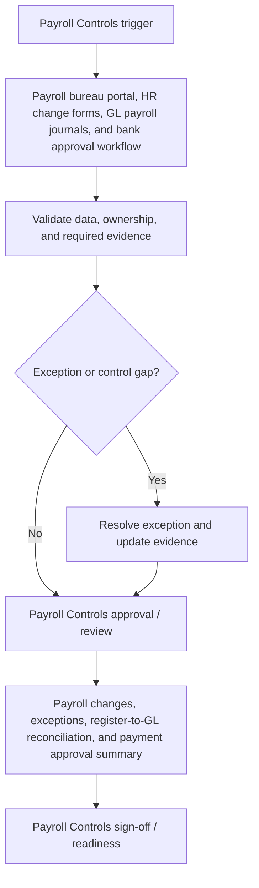

# Payroll Controls Requirements Pack

**Prepared for:** Riverstone Care Ltd

**Purpose:** Translate finance process pain points into implementation-ready ERP requirements, controls, reporting needs, audit trail expectations, and UAT coverage.

## Executive Summary

Riverstone Care Ltd needs a structured Payroll Controls requirements pack to reduce rework, clarify control ownership, and make Sage Payroll and Xero Finance implementation decisions testable. The pack translates starter and leaver control gaps, payroll change approval delays, and manual payroll input checks into requirements for workflow, data, controls, reporting, audit trail, and UAT. It is sized for 650 employees and monthly payroll control review and frames the control design, reporting outputs, and acceptance criteria needed within a target delivery window of 9 weeks.

## Business Problem

The current Payroll Controls process relies on Payroll bureau portal, HR change forms, GL payroll journals, and bank approval workflow. That creates avoidable risk around starter and leaver control gaps, payroll change approval delays, and manual payroll input checks and leaves finance without a consistent requirements baseline for process design, configuration, controls, reporting, and UAT. The implementation needs clearer ownership, defined data fields, control evidence, and acceptance criteria before ERP optimisation or automation can be delivered with confidence.

## Process Scope

The future-state scope covers Payroll master changes, input approval, exception review, payroll reconciliation, payment approval, and evidence retention; Controls over starters, leavers, salary changes, bank detail changes, overtime, deductions, and payroll payment files; and Period-end payroll sign-off evidence for finance, HR, and audit review. The design will support multi-site care services provider users on Sage Payroll and Xero Finance, with emphasis on payroll master data approval, exception review, payment file approval, and reconciliation.

## In Scope

- Payroll Controls requirements for the agreed multi-site care services provider process.
- Workflow, data, controls, reporting, audit trail, and UAT requirements for Sage Payroll and Xero Finance.
- Process pain points covering starter and leaver control gaps, payroll change approval delays, and manual payroll input checks.
- Reporting requirement: Payroll changes, exceptions, register-to-GL reconciliation, and payment approval summary.
- Implementation window and readiness assumptions for the 9 weeks target window.

## Out of Scope

- Live system configuration, data migration execution, and production cutover.
- Custom integration build or external workflow automation.
- Legal, tax, HR, or statutory sign-off outside the finance process owner remit.
- Direct processing of operational production data.
- Process areas outside Payroll Controls unless approved as a separate phase.

## Stakeholders and Roles

- Finance Transformation Lead: accountable for business sign-off and prioritisation.
- Payroll Controls process owner: validates workflow scope, controls, and exceptions.
- Finance systems analyst: translates requirements into configuration and UAT coverage.
- Preparer or operational user: confirms day-to-day inputs, handoffs, and evidence needs.
- Reviewer or controller: approves control design, reporting outputs, and acceptance criteria.

## Functional Requirements

- FR-01: Capture employee ID, payroll period, change type, effective date, requester, approver, and payroll status.
- FR-02: Route starters, leavers, salary changes, bank detail changes, and deductions for approval before payroll processing.
- FR-03: Track payroll input files with preparer, reviewer, version, cutoff date, and approval status.
- FR-04: Identify payroll exceptions for duplicate employees, negative pay, unusual overtime, net pay variance, and missing approvals.
- FR-05: Reconcile payroll register totals to GL payroll control accounts and payment file totals.
- FR-06: Require payroll payment file approval before release to bank.
- FR-07: Store leaver final pay checks, access removal confirmation, and termination effective date evidence.
- FR-08: Produce payroll control pack with changes, exceptions, reconciliation, payment approval, and sign-off details.

## Data Requirements

- DR-01: Employee ID
- DR-02: Payroll period
- DR-03: Payroll change type
- DR-04: Effective date
- DR-05: Approval reference
- DR-06: Gross-to-net total
- DR-07: Payroll control account
- DR-08: Payment file reference

## Controls

- CTRL-01: Starter, leaver, salary, deduction, and bank detail changes require approval before payroll processing.
- CTRL-02: Payroll input files require preparer and reviewer sign-off before calculation.
- CTRL-03: Payroll exceptions over threshold require investigation and approval.
- CTRL-04: Payroll register must reconcile to GL control accounts and payment file totals.
- CTRL-05: Payroll payment file release requires finance approval.

## Reporting Requirements

- RPT-01: Provide Payroll changes, exceptions, register-to-GL reconciliation, and payment approval summary.
- RPT-02: Show owner, status, ageing, exception reason, and next action where relevant to Payroll Controls.
- RPT-03: Support finance manager review with exportable period-end evidence.
- RPT-04: Separate open exceptions from completed, approved, or signed-off items.
- RPT-05: Make reporting outputs readable by finance users without system administrator access.

## Audit Trail Requirements

- AUD-01: Store payroll master change request, approval, processing, and effective date history.
- AUD-02: Record payroll input file version, preparer, reviewer, approval, and cutoff timestamp.
- AUD-03: Preserve exception review notes and approval decisions.
- AUD-04: Track payroll reconciliation owner/status history by period.
- AUD-05: Keep payment file approval evidence with approver, date, amount, and bank file reference.

## User Stories

- As a payroll manager, I want approved starter and leaver changes so that payroll master data is controlled.
- As a finance reviewer, I want payroll register-to-GL reconciliation so that payroll costs are supported.
- As a payroll preparer, I want exception checks before payment so that unusual items are investigated.
- As an approver, I want payment file evidence so that bank release is controlled.
- As an auditor, I want payroll change approval history so that sensitive changes are traceable.

## UAT Test Cases

- **UAT-01:** Salary change is entered after payroll cutoff. Expected result: The change requires late-change approval before processing.
- **UAT-02:** Employee bank details are changed before payroll run. Expected result: Payroll processing is blocked until approval evidence is captured.
- **UAT-03:** Payroll register does not reconcile to the GL control account. Expected result: A reconciliation difference is created with owner, amount, and reason fields.
- **UAT-04:** Net pay variance exceeds exception threshold. Expected result: The exception appears in the payroll review queue and requires approval.
- **UAT-05:** Payment file is prepared for release. Expected result: Finance approval is required before payment file status becomes released.
- **UAT-06:** Payroll control pack is exported. Expected result: The pack includes changes, exceptions, reconciliation, payment approval, and sign-off evidence.

## Acceptance Criteria

- Payroll master changes require approval and retain requester, approver, and effective date.
- Payroll exceptions are visible with owner, status, reason, and approval evidence.
- Payroll register reconciles to GL control accounts and payment file totals.
- Payment file release cannot occur without finance approval.
- Payroll control pack exports with change, exception, reconciliation, and sign-off evidence.

## Implementation Risks and Dependencies

- HR and payroll ownership of master data changes must be agreed.
- Payroll cutoff rules and approval thresholds require policy sign-off.
- Sensitive payroll access roles must be configured carefully.
- GL account mapping must be validated before reconciliation testing.
- Historic payroll exception categories may need standardisation before rollout.

## Implementation Notes

- Confirm Payroll Controls process owner and reviewer roles before design sign-off.
- Validate the required data fields against Sage Payroll and Xero Finance configuration.
- Run UAT with approved sample scenarios before production data migration or cutover.
- Keep any future AI-assisted drafting behind structured templates and human approval.

## Visual Process Documentation

The Mermaid diagram below can be copied into Mermaid-compatible tools for rendering.

### Process Map Summary

- Trigger: Payroll Controls trigger.
- Intake/source: Payroll bureau portal, HR change forms, GL payroll journals, and bank approval workflow.
- Validation: confirm data completeness, ownership, control evidence, and exception status.
- Exception handling: route exceptions to the process owner before approval or readiness.
- Approval/review: Payroll Controls approval / review.
- Reporting/evidence: Payroll changes, exceptions, register-to-GL reconciliation, and payment approval summary.
- Sign-off/readiness: confirm Payroll Controls evidence and acceptance criteria before build.

## Control-Risk Matrix

| Process Area | Risk Area | Risk Description | Control Objective | Control Activity | Control Type | Frequency | Owner | Evidence Required | System/Data Dependency | Related Requirement ID | Related UAT Case | Residual Risk / Implementation Note |
| --- | --- | --- | --- | --- | --- | --- | --- | --- | --- | --- | --- | --- |
| Payroll Controls | Starter and leaver control gaps | Payroll Controls may experience starter and leaver control gaps if ownership, data, controls, and evidence are not defined before build. | Reduce risk from starter and leaver control gaps through clear ownership, evidence, and review criteria. | Starter, leaver, salary, deduction, and bank detail changes require approval before payroll processing. | Preventive | Each payroll cycle | Payroll Controls Owner | Store payroll master change request, approval, processing, and effective date history. | Sage Payroll and Xero Finance data, required fields, owner status, and evidence references must be available for review. | FR-01 | UAT-01 | HR and payroll ownership of master data changes must be agreed. |
| Payroll Controls | Payroll change approval delays | Payroll Controls may experience payroll change approval delays if ownership, data, controls, and evidence are not defined before build. | Reduce risk from payroll change approval delays through clear ownership, evidence, and review criteria. | Payroll input files require preparer and reviewer sign-off before calculation. | Detective | Each payroll cycle | Payroll Controls Owner | Record payroll input file version, preparer, reviewer, approval, and cutoff timestamp. | Sage Payroll and Xero Finance data, required fields, owner status, and evidence references must be available for review. | FR-02 | UAT-02 | Payroll cutoff rules and approval thresholds require policy sign-off. |
| Payroll Controls | Manual payroll input checks | Payroll Controls may experience manual payroll input checks if ownership, data, controls, and evidence are not defined before build. | Reduce risk from manual payroll input checks through clear ownership, evidence, and review criteria. | Payroll exceptions over threshold require investigation and approval. | Corrective | Each payroll cycle | Payroll Controls Owner | Preserve exception review notes and approval decisions. | Sage Payroll and Xero Finance data, required fields, owner status, and evidence references must be available for review. | FR-03 | UAT-03 | Sensitive payroll access roles must be configured carefully. |
| Payroll Controls | Starter and leaver control gaps | Payroll Controls may experience starter and leaver control gaps if ownership, data, controls, and evidence are not defined before build. | Reduce risk from starter and leaver control gaps through clear ownership, evidence, and review criteria. | Payroll register must reconcile to GL control accounts and payment file totals. | Manual | Each payroll cycle | Payroll Controls Owner | Track payroll reconciliation owner/status history by period. | Sage Payroll and Xero Finance data, required fields, owner status, and evidence references must be available for review. | FR-04 | UAT-04 | GL account mapping must be validated before reconciliation testing. |
| Payroll Controls | Payroll change approval delays | Payroll Controls may experience payroll change approval delays if ownership, data, controls, and evidence are not defined before build. | Reduce risk from payroll change approval delays through clear ownership, evidence, and review criteria. | Payroll payment file release requires finance approval. | Automated | Each payroll cycle | Payroll Controls Owner | Keep payment file approval evidence with approver, date, amount, and bank file reference. | Sage Payroll and Xero Finance data, required fields, owner status, and evidence references must be available for review. | FR-05 | UAT-05 | Historic payroll exception categories may need standardisation before rollout. |

## Public-Safe Sample Data Note

This pack was generated from fictional, public-safe sample inputs. It does not contain real employer, client, supplier, bank, VAT, payroll, or operational data. Do not upload confidential business information into a public demo.
