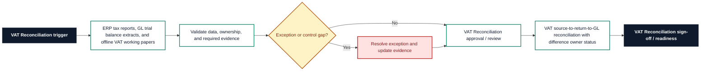

# VAT Reconciliation Requirements Pack

**Prepared for:** Demo Manufacturing Co

**Purpose:** Translate finance process pain points into implementation-ready ERP requirements, controls, reporting needs, audit trail expectations, and UAT coverage.

## Executive Summary

Demo Manufacturing Co needs a structured VAT Reconciliation requirements pack to reduce rework, clarify control ownership, and make SAP Business One implementation decisions testable. The pack translates vAT return differences, manual source register checks, and missing filing evidence into requirements for workflow, data, controls, reporting, audit trail, and UAT. It is sized for Quarterly VAT return with 15 active tax codes and frames the control design, reporting outputs, and acceptance criteria needed within a target delivery window of 6 weeks.

## Business Problem

The current VAT Reconciliation process relies on ERP tax reports, GL trial balance extracts, and offline VAT working papers. That creates avoidable risk around vAT return differences, manual source register checks, and missing filing evidence and leaves finance without a consistent requirements baseline for process design, configuration, controls, reporting, and UAT. The implementation needs clearer ownership, defined data fields, control evidence, and acceptance criteria before ERP optimisation or automation can be delivered with confidence.

## Process Scope

The future-state scope covers VAT source register extraction, VAT return box mapping, GL VAT control account reconciliation, and filing evidence; Clear ownership of reconciling differences before submission; and Audit trail for adjustments, review, and filing approval. The design will support vat-registered manufacturing entity users on SAP Business One, with emphasis on vat filing evidence, adjustment approval, and audit trail.

## In Scope

- VAT Reconciliation requirements for the agreed vat-registered manufacturing entity process.
- Workflow, data, controls, reporting, audit trail, and UAT requirements for SAP Business One.
- Process pain points covering vAT return differences, manual source register checks, and missing filing evidence.
- Reporting requirement: VAT source-to-return-to-GL reconciliation with difference owner status.
- Implementation window and readiness assumptions for the 6 weeks target window.

## Out of Scope

- Live system configuration, data migration execution, and production cutover.
- Custom integration build or external workflow automation.
- Legal, tax, HR, or statutory sign-off outside the finance process owner remit.
- Direct processing of operational production data.
- Process areas outside VAT Reconciliation unless approved as a separate phase.

## Stakeholders and Roles

- Finance Transformation Lead: accountable for business sign-off and prioritisation.
- VAT Reconciliation process owner: validates workflow scope, controls, and exceptions.
- Finance systems analyst: translates requirements into configuration and UAT coverage.
- Preparer or operational user: confirms day-to-day inputs, handoffs, and evidence needs.
- Reviewer or controller: approves control design, reporting outputs, and acceptance criteria.

## Functional Requirements

- FR-01: Capture VAT source register totals for sales, purchases, output tax, input tax, and adjustments.
- FR-02: Map source register totals to VAT return boxes using approved tax code rules.
- FR-03: Reconcile VAT return boxes to GL VAT control accounts for the reporting period.
- FR-04: Identify differences by tax code, transaction source, entity, and reporting period.
- FR-05: Track reconciling items with owner, status, reason, amount, and resolution action.
- FR-06: Store filing evidence including return version, approver, submission reference, and filing date.
- FR-07: Prevent submission readiness until material differences are reviewed.
- FR-08: Produce a VAT reconciliation pack for finance manager and audit review.

## Data Requirements

- DR-01: VAT registration/entity
- DR-02: Tax code
- DR-03: Source register amount
- DR-04: VAT return box number
- DR-05: GL VAT control account
- DR-06: Reconciling difference
- DR-07: Adjustment journal reference
- DR-08: Filing submission reference

## Controls

- CTRL-01: VAT return cannot be marked ready where material differences are unresolved.
- CTRL-02: Adjustments require reason code, supporting note, and reviewer approval.
- CTRL-03: VAT return box mapping changes require finance owner sign-off.
- CTRL-04: GL VAT control account reconciliation must be completed before filing approval.
- CTRL-05: Filing evidence must include approver, date, and submission reference.

## Reporting Requirements

- RPT-01: Provide VAT source-to-return-to-GL reconciliation with difference owner status.
- RPT-02: Show owner, status, ageing, exception reason, and next action where relevant to VAT Reconciliation.
- RPT-03: Support finance manager review with exportable period-end evidence.
- RPT-04: Separate open exceptions from completed, approved, or signed-off items.
- RPT-05: Make reporting outputs readable by finance users without system administrator access.

## Audit Trail Requirements

- AUD-01: Store source register extraction date, preparer, and data source.
- AUD-02: Record VAT box mapping versions and change approvals.
- AUD-03: Preserve reconciling difference owner/status history.
- AUD-04: Keep adjustment journal references and review decisions.
- AUD-05: Record filing approval and submission evidence.

## User Stories

- As a tax preparer, I want source registers mapped to VAT return boxes so that return totals are traceable.
- As a finance reviewer, I want GL VAT control accounts reconciled so that balance sheet VAT is explained.
- As a tax manager, I want material differences blocked before filing so that submission risk is reduced.
- As an auditor, I want VAT box mapping history so that changes to tax treatment can be reviewed.
- As a finance controller, I want filing evidence stored with the pack so that audit requests are faster.

## UAT Test Cases

- **UAT-01:** Source register total does not agree to a VAT return box. Expected result: A reconciling difference is created with owner, amount, and reason fields.
- **UAT-02:** GL VAT control account does not agree to return liability. Expected result: The variance is flagged and submission readiness is blocked if material.
- **UAT-03:** VAT return box mapping is changed. Expected result: The change is versioned and requires finance owner sign-off.
- **UAT-04:** Adjustment journal is posted after review. Expected result: Journal reference and approval evidence are stored against the difference.
- **UAT-05:** Filing approval is attempted without submission reference. Expected result: Filing evidence is incomplete and approval cannot be finalised.
- **UAT-06:** VAT reconciliation pack is exported. Expected result: The pack includes source registers, VAT return boxes, GL VAT control accounts, differences, and filing evidence.

## Acceptance Criteria

- Source registers, VAT return boxes, and GL VAT control accounts are reconciled in one pack.
- Material differences are owner-assigned and cannot be ignored before filing.
- VAT box mapping changes are versioned and approved.
- Filing evidence includes submission reference, approver, and filing date.
- Adjustments are supported by reason, journal reference, and reviewer sign-off.

## Implementation Risks and Dependencies

- Tax code mapping must be agreed before configuration.
- GL VAT control accounts may require cleanup before reliable reconciliation.
- Filing approval roles must match the finance governance model.
- External tax advisor review may be required for complex adjustments.
- Multi-entity VAT registrations need clear scope before rollout.

## Implementation Notes

- Confirm VAT Reconciliation process owner and reviewer roles before design sign-off.
- Validate the required data fields against SAP Business One configuration.
- Run UAT with approved sample scenarios before production data migration or cutover.
- Keep any future AI-assisted drafting behind structured templates and human approval.

## Visual Process Documentation

The Mermaid diagram below can be copied into Mermaid-compatible tools for rendering.

### Process Map Summary

- Trigger: VAT Reconciliation trigger.
- Intake/source: ERP tax reports, GL trial balance extracts, and offline VAT working papers.
- Validation: confirm data completeness, ownership, control evidence, and exception status.
- Exception handling: route exceptions to the process owner before approval or readiness.
- Approval/review: VAT Reconciliation approval / review.
- Reporting/evidence: VAT source-to-return-to-GL reconciliation with difference owner status.
- Sign-off/readiness: confirm VAT Reconciliation evidence and acceptance criteria before build.

## Control-Risk Matrix

| Process Area | Risk Area | Risk Description | Control Objective | Control Activity | Control Type | Frequency | Owner | Evidence Required | System/Data Dependency | Related Requirement ID | Related UAT Case | Residual Risk / Implementation Note |
| --- | --- | --- | --- | --- | --- | --- | --- | --- | --- | --- | --- | --- |
| VAT Reconciliation | VAT return differences | VAT Reconciliation may experience vat return differences if ownership, data, controls, and evidence are not defined before build. | Reduce risk from vat return differences through clear ownership, evidence, and review criteria. | VAT return cannot be marked ready where material differences are unresolved. | Preventive | Each period close | VAT Reconciliation Process Owner | Store source register extraction date, preparer, and data source. | SAP Business One data, required fields, owner status, and evidence references must be available for review. | FR-01 | UAT-01 | Tax code mapping must be agreed before configuration. |
| VAT Reconciliation | Manual source register checks | VAT Reconciliation may experience manual source register checks if ownership, data, controls, and evidence are not defined before build. | Reduce risk from manual source register checks through clear ownership, evidence, and review criteria. | Adjustments require reason code, supporting note, and reviewer approval. | Detective | Each period close | VAT Reconciliation Process Owner | Record VAT box mapping versions and change approvals. | SAP Business One data, required fields, owner status, and evidence references must be available for review. | FR-02 | UAT-02 | GL VAT control accounts may require cleanup before reliable reconciliation. |
| VAT Reconciliation | Missing filing evidence | VAT Reconciliation may experience missing filing evidence if ownership, data, controls, and evidence are not defined before build. | Reduce risk from missing filing evidence through clear ownership, evidence, and review criteria. | VAT return box mapping changes require finance owner sign-off. | Corrective | Each period close | VAT Reconciliation Process Owner | Preserve reconciling difference owner/status history. | SAP Business One data, required fields, owner status, and evidence references must be available for review. | FR-03 | UAT-03 | Filing approval roles must match the finance governance model. |
| VAT Reconciliation | VAT return differences | VAT Reconciliation may experience vat return differences if ownership, data, controls, and evidence are not defined before build. | Reduce risk from vat return differences through clear ownership, evidence, and review criteria. | GL VAT control account reconciliation must be completed before filing approval. | Manual | Each period close | VAT Reconciliation Process Owner | Keep adjustment journal references and review decisions. | SAP Business One data, required fields, owner status, and evidence references must be available for review. | FR-04 | UAT-04 | External tax advisor review may be required for complex adjustments. |
| VAT Reconciliation | Manual source register checks | VAT Reconciliation may experience manual source register checks if ownership, data, controls, and evidence are not defined before build. | Reduce risk from manual source register checks through clear ownership, evidence, and review criteria. | Filing evidence must include approver, date, and submission reference. | Automated | Each period close | VAT Reconciliation Process Owner | Record filing approval and submission evidence. | SAP Business One data, required fields, owner status, and evidence references must be available for review. | FR-05 | UAT-05 | Multi-entity VAT registrations need clear scope before rollout. |

## Public-Safe Sample Data Note

This pack was generated from fictional, public-safe sample inputs. It does not contain real employer, client, supplier, bank, VAT, payroll, or operational data. Do not upload confidential business information into a public demo.
